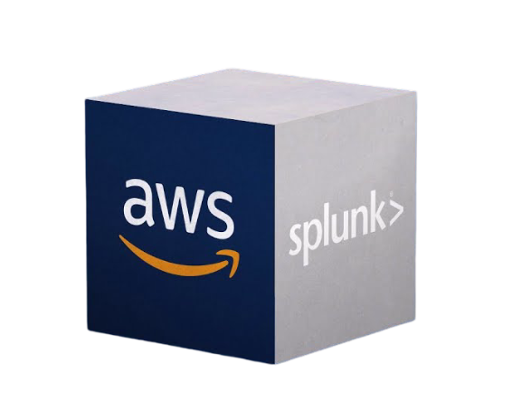

# Automated Ingestion & Response (AIR) Lab 

## 1. Introduction
The Automated Ingestion Response lab demonstrates a full cloud security monitoring and automated incident response pipline using **AWS** and **Splunk**. 

Instead of relying on a single telemetry source to respond to threats, this lab demonstrates how logs across the control and data plane can be correlated to provide expanded visibility into internal adversary tactics and techniques to enable effective automated mitigation. 

## 2. Background
As organizations continue migrating operations to the cloud, these environments have become critical components of enterprise infrastructure. Monitoring these workloads and operations are essential for business continuity and maintaing an important security posture. Comprehensive logging and monitoring across both the control and data plane, paired with sevrless compute functions can provide active defense for these critical enviroments.

## 3. Scenario
This scenario models an internal machine launching MITRE-mapped attacks against an internal cloud workload operating within the same AWS account. The attacker will will move laterally from the its own instace to the private instance. 

Activity from the attacker will generate telemetry across AWS API logs, VPC network flow metadata, and host-based Linux logs. These sources are ingested into a Splunk instance, where they are normalized, correlated, and analyzed to detect malicious behavior and trigger automated response actions via Lambda Functions.

## 4. System Architecture

List of services used in this lab:

## 5. Design Decisions

### 5.1 VPC Endpoint vs NAT Gateway

This lab models a segmented enterprise intranet architecture and reduces the total attack surface by disasbling internet connectivity. By eliminating public ingress and eress traffic, the system isolates internal traffic and lateral movement scenarios and allows focused evaluation of detection and response capatabilities against internal threats. 

### 5.2 Pull vs Push Method

AIR is structured to represent monitoring across seperate planes in the cloud. On the data plane, VPC flow logs and local logs are used to capture traffic from and within the EC2 instances. On the control plane, CloudTrail logs configuration changes and API calls in AWS. A Splunk Enterprise pulls these logs periodically via Splunk Universal Forwarder, CloudWatch, and S3 and sends alerts to invoke Lambda functions on any malicious activity.

VPC Flow Logs -> CloudWatch -> Splunk Enterprise  
CloudTrail -> S3 -> Splunk Enterprise  
Linux Auditd -> Splunk Universal Forwarder -> Splunk Enterprise

## 6. Threat Model
The threat model can be found [here](https://github.com/edwardungere/AIR/blob/main/architecture/threat-model.md)

